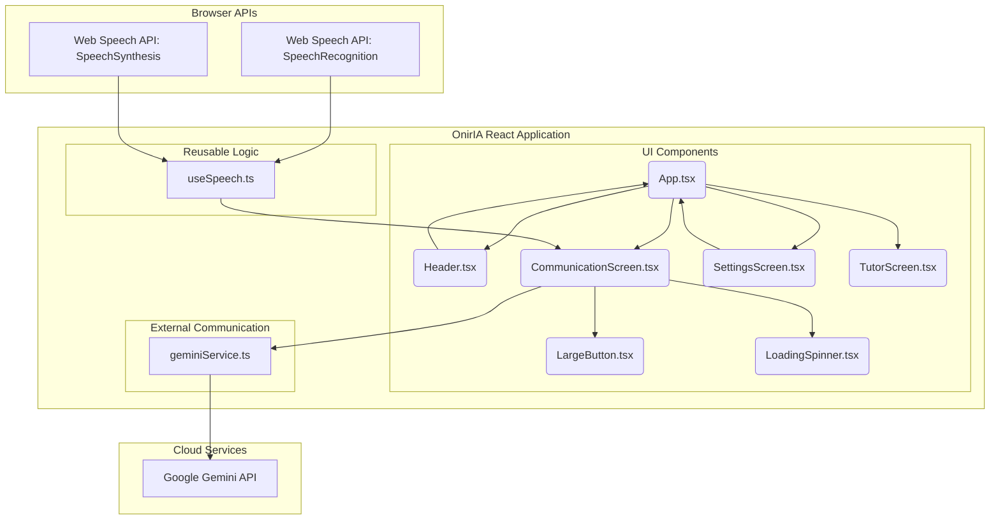

# OnirIA v5.0: Technical Master Document (Web Edition)

**Version:** 5.0 ("Claridad Universal")
**Status:** In Development
**Stack:** React, TypeScript, Vite, Web Speech API, Google Gemini API
**Primary Audience:** Development and Maintenance Teams

---

## 1. Introduction

This document provides a complete technical blueprint for the OnirIA v5.0 web application. It serves as the single source of truth for understanding the system's architecture, its components, and its core functionalities.

OnirIA v5.0 is a cutting-edge, browser-based, multimodal assistive communicator. It is designed to be a fully responsive Progressive Web App (PWA) that works seamlessly across devices, with a strong focus on accessibility, offline-first capabilities where possible, and user privacy.

---

## 2. Core Architectural Principles

1.  **Component-Based & Reactive:** Built with React, the UI is a composition of modular, reusable, and stateful components. State changes drive UI updates automatically.
2.  **Browser-Native Power:** Leverages powerful, built-in browser APIs like the Web Speech API (`SpeechSynthesis` and `SpeechRecognition`) for core real-time functionalities, reducing dependency on external libraries.
3.  **Intelligent Services:** Integrates with the Google Gemini API for advanced AI-powered text manipulation, providing features that go beyond simple communication.
4.  **Accessibility First (A11y):** Designed from the ground up to be accessible, using semantic HTML, ARIA attributes, high-contrast themes, and large, touch-friendly targets.
5.  **State Management:** Utilizes React hooks (`useState`, `useContext`, `useEffect`) for efficient and localized state management. Global state is lifted to the main `App` component as needed.

---

## 3. System Architecture & Data Flow

The application is structured around a clear separation of concerns: Components (UI), Hooks (Logic), and Services (External APIs).



### Module Breakdown:

-   **Components (`/components`):**
    -   `App.tsx`: The root component. Manages global state (like the current screen and feature toggles) and renders the appropriate screen.
    -   `CommunicationScreen.tsx`: The core interface for user communication. Hosts the text area, action buttons, and conditionally renders the Auditory Accessibility Mode UI.
    -   `SettingsScreen.tsx`: Allows users to configure application settings, such as enabling/disabling feature modules.
    -   `Header.tsx`: Provides consistent navigation across the application.
    -   `LargeButton.tsx`: A reusable, accessible button component for primary actions.

-   **Hooks (`/hooks`):**
    -   `useSpeech.ts`: A powerful custom hook that encapsulates the entire Web Speech API. It provides a simple interface for speech-to-text (listening) and text-to-speech (speaking), managing permissions and browser compatibility quirks.

-   **Services (`/services`):**
    -   `geminiService.ts`: Manages all communication with the Google Gemini API. It abstracts away the API key and request/response logic, providing simple functions for AI-powered text correction and rephrasing.

---

## 4. Feature Modules

### 4.1. Auditory Accessibility Module (AAM)
-   **Purpose:** To assist users with hearing impairments by transcribing ambient speech to text in real-time.
-   **Core Components:** `useSpeech.ts`, `SettingsScreen.tsx`, `CommunicationScreen.tsx`.
-   **Status: Phase 1 (Real-time transcription) is IMPLEMENTED.**
-   **Functionality:** When enabled in Settings, the `CommunicationScreen` switches to a high-contrast view. The `useSpeech` hook is activated in continuous listening mode, and the transcribed text is displayed in a large, readable font.

### 4.2. Literacy and Composition Assistance Module (ACAL)
-   **Purpose:** To empower users with writing difficulties through AI-powered assistance.
-   **Core Components:** `geminiService.ts`, `CommunicationScreen.tsx`.
-   **Status: Phase 1 (Intelligent Correction) is IMPLEMENTED.**
-   **Functionality:** A user can type text with errors and press the "Corregir (IA)" button. The text is sent to the `geminiService` with a specialized prompt that instructs the Gemini model to correct the text while preserving the original intent.

### 4.3. Gesture and Tutor Modules
-   **Status:** Planned. These modules will be implemented in future versions. `GestureScreen.tsx` and `TutorScreen.tsx` exist as placeholders.

---

## 5. Getting Started

**Prerequisites:**
-   Node.js (LTS version)
-   npm or yarn
-   A modern web browser (Chrome, Firefox, Edge)

**Setup:**
1.  **Clone the repository.**
2.  **Install dependencies:** `npm install`
3.  **Set up environment variables:** Create a `.env.local` file in the root directory and add your Google Gemini API key:
    ```
    VITE_GEMINI_API_KEY=tu_api_key_aqui
    ```
4.  **Run the development server:** `npm run dev`
5.  Open the provided URL in your browser.
